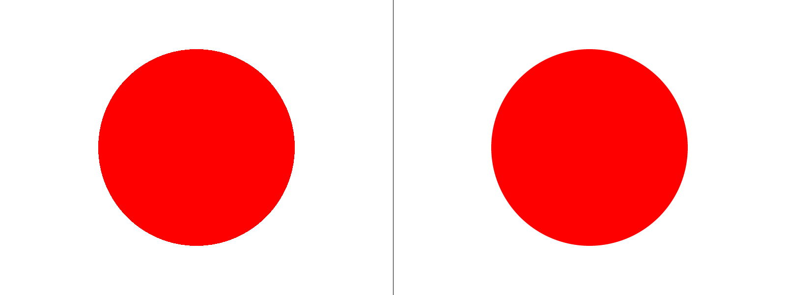
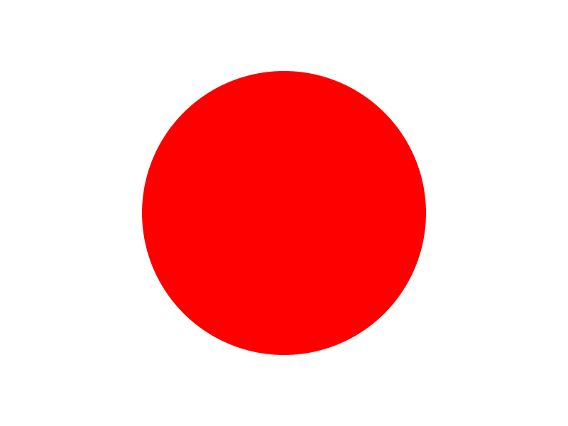

  

<h1 align="center">FSAA</h1>

  Full Scene Anti-Aliasing (FSAA) Takes Multiple Colour & Depth Samples at Slightly Different Locations Within Each Pixel, Instead of Just One, During The Rendering Process, Affecting Every Pixel, Every Texture, & all Geometry in the Image

## Comparison

| No Anti-Aliasing                                                                | Anti-Aliasing                                                                 | Full Screen Anti-Aliasing                                                          |
| :------------------------------------------------------------------------------ | :------------------------------------------------------------------------------ | :---------------------------------------------------------------------------------- |
|             |             |         |
| Notice the jagged edges on the circle, this is due to the lack of anti-aliasing | Notice the edges are smoother, this is due to the anti-aliasing being applied | Notice the edges are even smoother, this is due to the full screen anti-aliasing |
